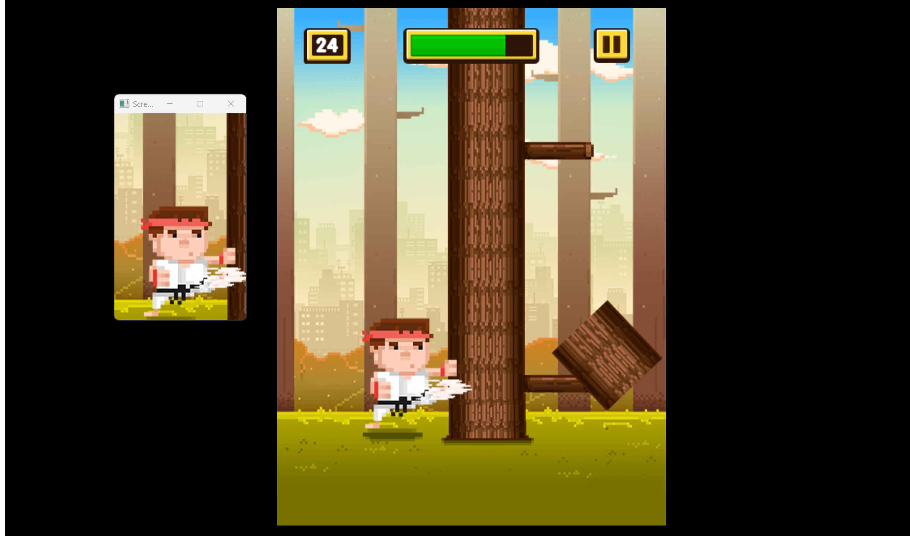

# 自动化打木桩（OpenCV）

## 项目概述
本项目使用OpenCV实现自动化打木桩的功能。通过图像匹配技术，识别游戏中的木桩位置，并自动点击进行操作。

## 效果展示


## 技术要点
- **OpenCV图像匹配**：使用OpenCV的模板匹配功能来识别屏幕中的木桩。
- **屏幕截图**：使用`mss`库进行高效的屏幕截图。
- **鼠标控制**：使用`pyautogui`库进行鼠标点击操作。
- **键盘监听**：使用`keyboard`库监听键盘按键，控制程序的启动和停止。

## 安装依赖
确保你已经安装了所有必要的依赖库。你可以通过以下命令安装：

```bash
pip install -r requirements.txt  
```

## 项目结构  
```bash
opencv/
├── PlayGame.py
|—— game.html
├── images/  
|   ├── game.png
│   ├── woodleft.png
│   └── woodright.png
└── README.md
```
项目中多余的文件(base.ipynb, DrawingShapes.ipynb, Tutorial.ipynb)为测试文件，请忽略。

## 使用说明
### 启动程序
先启动网页端小游戏(game.html)
```bash
python PlayGame.py
```

### 操作说明
- 按下 s 键开始自动化打木桩。  
- 按下 q 键停止程序。

## 注意事项
- ***权限***：某些操作可能需要管理员权限。
- ***兼容性***：确保你的屏幕分辨率及大小和木桩图像与代码中的设置相匹配。
- ***性能***：频繁的屏幕截图和图像处理可能会影响系统性能，请根据需要调整。

## 许可证
本项目采用[MIT许可证](LICENSE)。